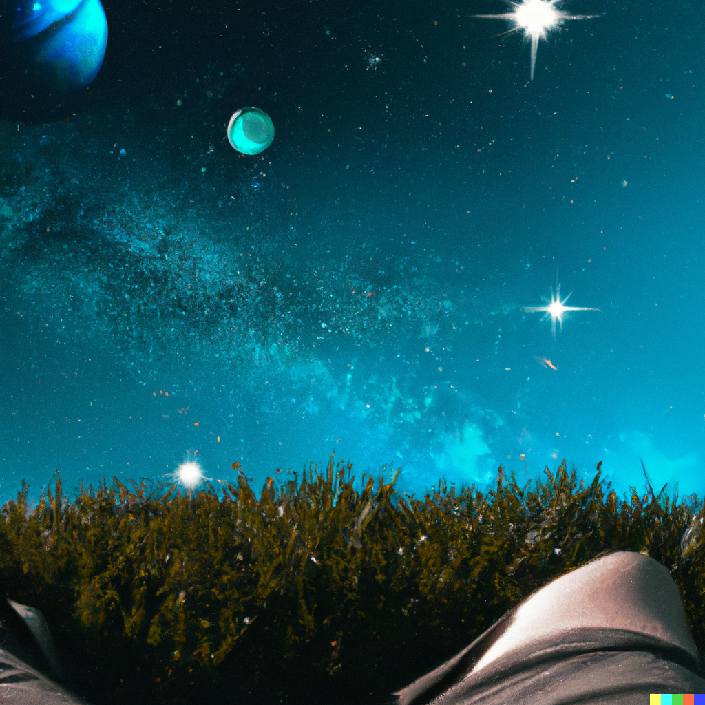

# Space Jumper
A Unity XR Application where users can "jump" to and from anywhere in the universe! Travelling all throughout space using hyper speed, jumping to and learning all about planets, stars, galaxies, space stations, satellites and more in mere moments!

[DALL-E 2 from OpenAI](https://openai.com/dall-e-2 "DALL-E 2 from OpenAI")

## Let's Build XR 30 Day Quest

A month long quest to instill good daily programming habits and best practices for developing XR applications in Unity, and using Git/GitHub for version control as well as project ideation and documentation. 

### Official Page: [Let's Build XR: 30 Day Quest](https://letsbuildxr.notion.site/Let-s-Build-XR-30-Day-Quest-04bbe158963545b5b7766b48861ff1a8?pvs=18)

Special thanks to JasonSpatial for the incredible help and generosity shown in creating this amazing learning community and opportunity to explore and develop XR applications in Unity! Thank you as well to all of my fellow XRgonauts who have inspired me with their kindness and courage, I am really looking forward to continuing this epic quest with everyone and to see all of our ideas come to life in Unity! =)